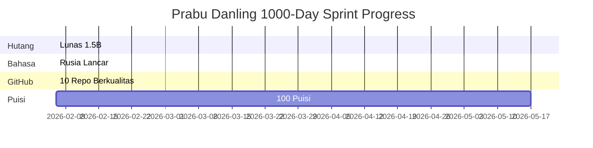
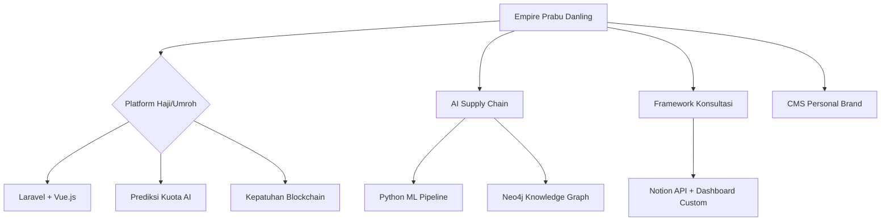

# 🏔️ Prabu Danling Resolusi 10 Tahun (2026-2036)


**"Prak burukeun, geura sadar dan eling"**  
*Strategic execution with spiritual awareness. Santri Angon discipline + Prabu Danling decisiveness. Darah biru Pajajaran mengalir.*

[
[
[
[

***

## 🎯 Executive Summary

**Tn. H. Gugun Gunara** – Keturunan Darah Biru Pajajaran, nama lain Santri Angon ( Santri = Pelajar, Angon = Menggembala ) jadi orang yang selalu belajar dan sedang belajar menggembala hawa napsunya sendiri. Polymath visioner mentransformasi penebusan hutang 1.5B menjadi **empire 15B/bulan** tahun 2036 melalui penguasaan IT, konsultasi manajemen kelas dunia, dan kepemimpinan pemikiran.

**Filosofi Inti**: Santri Angon (belajar seumur hidup, penguasaan diri) + Prabu Danling (eksekusi tegas dengan kesadaran spiritual) = Framework eksekusi tak terhentikan.

**Target 2036**: No.1 Indonesia di IT Architecture, Sistem Bisnis Haji/Umroh, Tulisan Spiritual-Bisnis.

***

## 🔬 Status Saat Ini (Baseline Feb 2026)

| Metrik | Nilai | Progres |
|--------|-------|---------|
| **Sisa Hutang** | 1.5B IDR | 95% lunas (28.5B/30B) |
| **Stream Pendapatan Aktif** | 4 (Software, Konsultasi, Konten, Tulisan) | Target 2B+/bulan |
| **Bahasa Rusia** | Pemula (mulai Agt 2025) | Lancar berbahasa Q2 2026 |
| **Puisi Harian** | Hari 1/1000 | Disiplin puisi transformatif |
| **Repo GitHub** | 1/10 | Fondasi portofolio kualitas |



***

## 🎖️ Roadmap Strategis 10 Tahun

### Fase 1: Fondasi (2026-2028)
**Tujuan**: Nol hutang + Penguasaan kompetensi inti

| Tahun | Target Revenue | Deliverable Utama | Metrik Sukses |
|-------|----------------|-------------------|---------------|
| 2026 | 2B/bulan | Lancar Rusia, 10 repo GitHub, 365 puisi | Hutang = 0, 1k bintang GitHub |
| 2027 | 5B/bulan | Proyek Rusia 40B, 5 klien enterprise | 5k bintang GitHub, buku pertama |
| 2028 | 8B/bulan | Fondasi holding company | 10 klien enterprise |

### Fase 2: Akselerasi (2029-2032) 
**Tujuan**: Dominasi pasar Indonesia

| Fokus Area | Tech Stack | Target |
|------------|------------|--------|
| **Platform Haji/Umroh** | Laravel + AI + Blockchain | 10k pengguna |
| **AI Supply Chain** | Python + TensorFlow + Neo4j | 5 klien besar |
| **Framework Konsultasi** | Notion + Airtable + Custom API | 100 konsultasi |

### Fase 3: Legenda (2033-2036)
**Tujuan**: Kepemimpinan pemikiran global + Warisan

- **Bestseller No.1**: "1000 Puisi Prabu Danling" (genre spiritual-business)
- **Holding Global**: 15B/bulan dari 15 enterprise
- **Filantropi**: Universitas IT Sunda + dana dampak 100B
- **Pribadi**: 3 anak pendidikan kelas dunia + penebusan keluarga

***

## 🛠️ Visi Arsitektur Teknologi



**Core Tech Stack 2036**:
```
Frontend: Next.js 20 + Tailwind + Framer Motion
Backend: Laravel 12 + Node.js Microservices
AI/ML: Python + TensorFlow + LangChain
Database: PostgreSQL + Neo4j + Redis
DevOps: GitHub Actions + Vercel + AWS
```

***

## 📈 Dashboard Progres Real-Time


### Metrik Live (Auto-update)
```
💰 Sisa Hutang: 1.5B IDR → [██████████] 95% selesai
📝 Puisi Ditulis: 1/1000 → [▌░░░░░░░░░] 0.1% selesai  
🗣️ Level Rusia: A1 → [▐░░░░░░░░░] 10% ke lancar
⭐ Bintang GitHub: 0 → [░░░░░░░░░░] Target 10k
```

***

## ✨ Ritual Eksekusi Harian (Framework Prabu Danling)

```
05:00-05:15 → Puisi #X (disiplin haiku 3menit)
05:15-07:00 → Rusia (2jam deliberate practice)
07:00-21:00 → Eksekusi 4 Stream Pendapatan
21:00-05:00 → Deep Work (Software/Konsultasi)
```

**Komitmen 1000 Hari**:
- [ ] 1 puisi harian → Kebijaksanaan transformatif
- [ ] 2jam Rusia → Senjata bahasa strategis
- [ ] Commit GitHub harian → Portofolio compounding
- [ ] 100% pendapatan → Prioritas alokasi hutang

***

## 🌍 Framework Kolaborasi Global

### 🎓 Kontribusi Santri Angon (Pelajar)
```
1. Fork → Tambah ide cemerlang ke roadmap
2. PR dengan rencana implementasi
3. Dapat kredit di LEGENDS.md
```

### 💼 Partnership Enterprise (Level Prabu Danling)
```
1. Issues → Kebutuhan konsultasi strategis
2. Sponsor → Sponsor fitur besar
3. Hire → Eksekusi proyek penuh
```

### 🏆 Hall of Fame Kontributor
| Rank | Kontributor | Dampak | Reward |
|------|-------------|--------|--------|
| 🥇 | [NAMA_KAMU] | 1k bintang pertama | Prioritas konsultasi seumur hidup |
| 🥈 | | | | 
| 🥉 | | | |

***

## 📚 Resources & Template Inti

### 1. **Template Puisi Harian**
```markdown
# Puisi #[NUMBER] - [TEMA]
[format haiku 3 baris]

**Bijak Abadi**: [Satu kebijaksanaan actionable]
**Impact Tracker**: [Hidup berubah: 0]
```

### 2. **Template Kontribusi Roadmap**
```yaml
# issues/new
Name: [Ide Fitur]
Fase: [1/2/3]
Dampak: [Revenue/Pengguna/Waktu Hemat]
Tech: [Stack dibutuhkan]
Priority: [Kritis/Tinggi/Medium]
```

***

## 🎖️ Sertifikasi Prabu Danling

```
🏆 SERTA PRABU DANLING CONTRIBUTOR
Diterbitkan: [TANGGAL] | Bintang Diperoleh: [NUMBER]
Skill Terbukti: [DAFTAR]
Level Berikutnya: [SANTRI/PRABU/LEGEND]
```

**[Verifikasi Sertifikat](https://prabudanling.github.io/prabu-danling-resolusi-10-tahun/cert/#YOUR_GITHUB)**

***

## 👑 Protokol Legenda

**Kesuksesan 2036 = Eksekusi Hari Ini**

```
Santri Angon → Belajar Terus-menerus (Input)
Prabu Danling → Eksekusi Tegas (Output)
Hasil → Legenda Politif (Dampak)
```

**Bintangi repository ini. Eksekusi resolusi 10 tahunmu sendiri. Jadilah legenda.**

***

*© 2026 Tn. H. Gugun Gunara, S.E., M.M. | Keturunan Darah Biru Pajajaran | MIT License | Prak burukeun, geura sadar dan eling.*

<div align="center">
  
[
[
[

</div>
